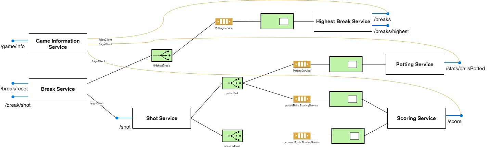
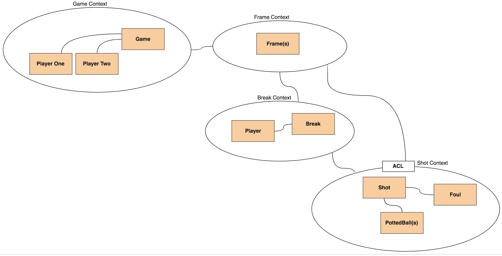
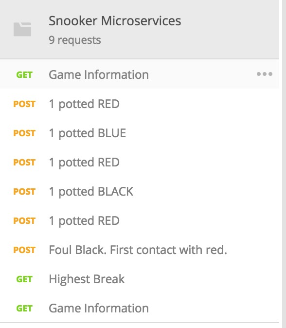
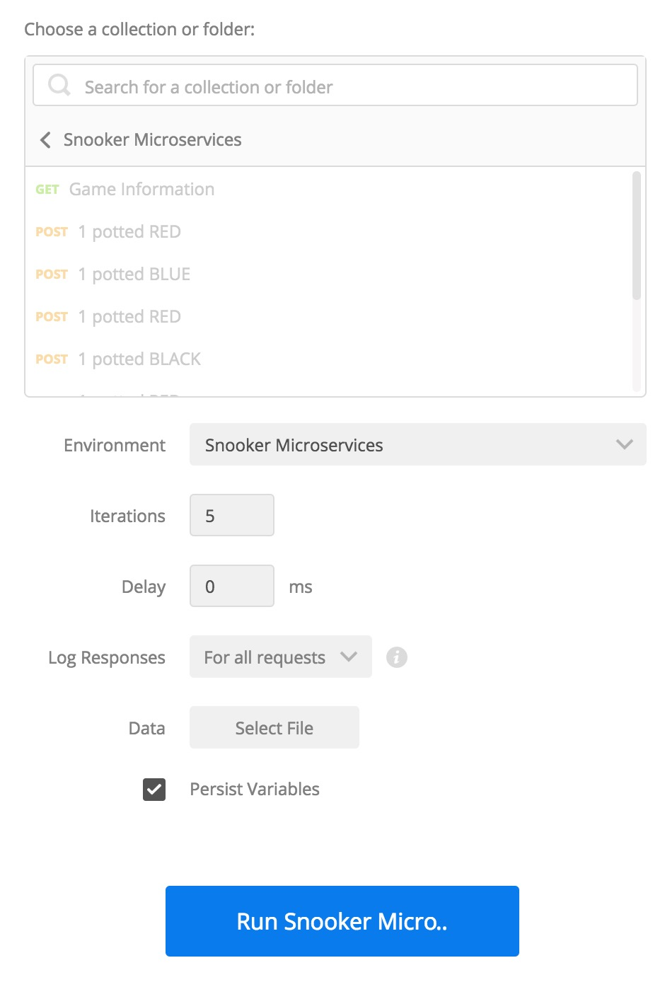
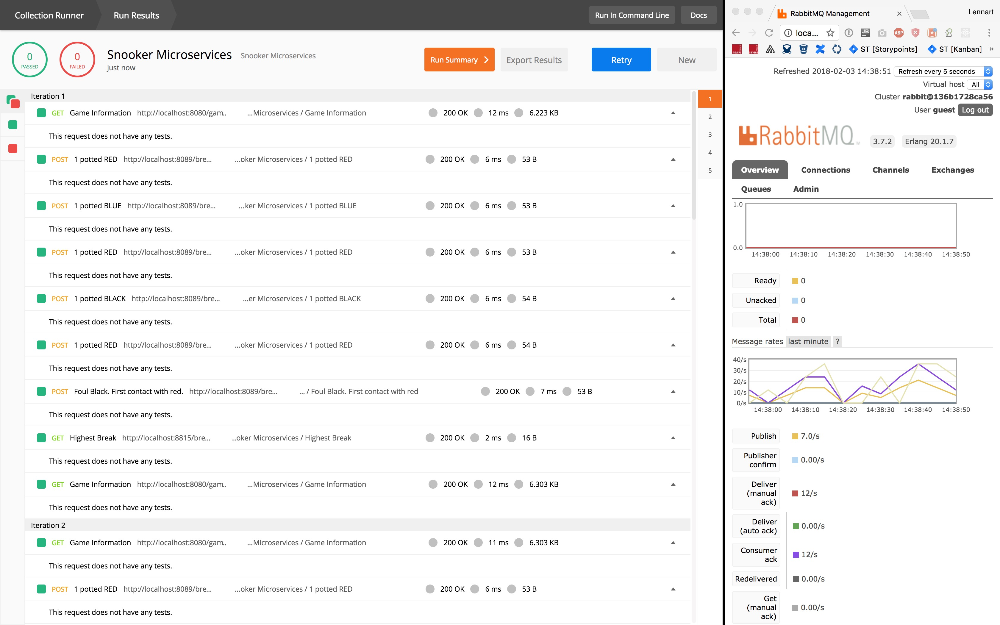

# Snooker Microservices

Project attempt for creating a microservices architecture implementing
the rules of Snooker with SpringBoot based on Domain Driven Design.

This project is meant to show the basic communication principles (REST,
Messaging) using a SpringBoot application in combination with frameworks
like [lombok](https://projectlombok.org/) or
[Netflix's feign](https://github.com/OpenFeign/feign).

## The infrastructure

## The context map

## Project setup
### Project requirments
Additionally to a suitable IDE (IntelliJ IDEA) you'll need to install
the Java SDK 8 + Gradle.

### RabbitMQ
For providing a messaging infrastructure, you have to start the
following docker image

- rabbitmq:management

The following ports must be published for viewing the admin webinterface
and using RabbitMQ within the SpringBoot appliction:

- tcp 15672
- tcp 5672

## Postman Testruns
To have an overview of the different service ports and addresses, you
can find suitable .json files in the [01_postman_information](01_postman_files) directory.

The requests can also be run with the Postman Collection runner.

A good way to simulate a break scenario and the resulted messaging
outcome in the RabbitMQ dashboard.

## Todos

- [ ] Player Switched after Break Finished
- [ ] Dynamic Player ID in Potted Ball Event
- [ ] Dynamic Player ID in Foul Occurred Event
- [ ] Hystrix for Shot Service?
- [ ] Include Eureka/Zuul Service discovery
- [ ] Persistent data in services
- [ ] Services must be stateless

